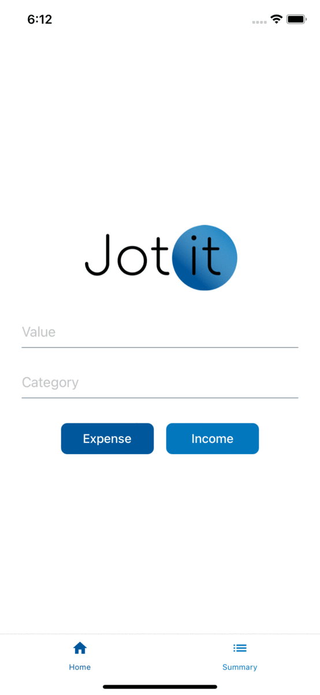

# jot-it
This repositiory was used during a React Native presentation in order to better explain the main concpets of the language.

*Disclaimer: This guide does not use Expo*

# Branch details

Each branch was used to explain a different concept:

- step-0-base-app &rarr; Used to show case a react native base app created through the command 

  ```npx react-native init MyApp --template react-native-template-typescript```

- step-1-structure &rarr; Used to explain an example of RN folder structure

- step-2-localization &rarr; Used to show how to introduce localization in a RN application

- step-3-styling &rarr; Used to show how to use styled component inside a RN application

- step-4-change-screen &rarr; Used to show how to handle navigation in a RN application

- step-5-redux &rarr; Used to show how to introduce Redux as state manager inside a RN application

- step-6-summary-screen &rarr; Used to introduce the following concepts 

- step-7-persistence &rarr; Used to show how to use Redux Persist to persist data in a RN application 

- step-8-finalization &rarr; This does some final refactoring

- step-9-mock-data &rarr; This introduces some mock data to play around

# How to run (IOS)

This application uses [cocoapdos](https://cocoapods.org/). In order to run it, you must install them first. 

Then, clone the repository and run the following commands: 

```
yarn
cd ios && pod install && cd -
yarn run ios
```

# Final Result




